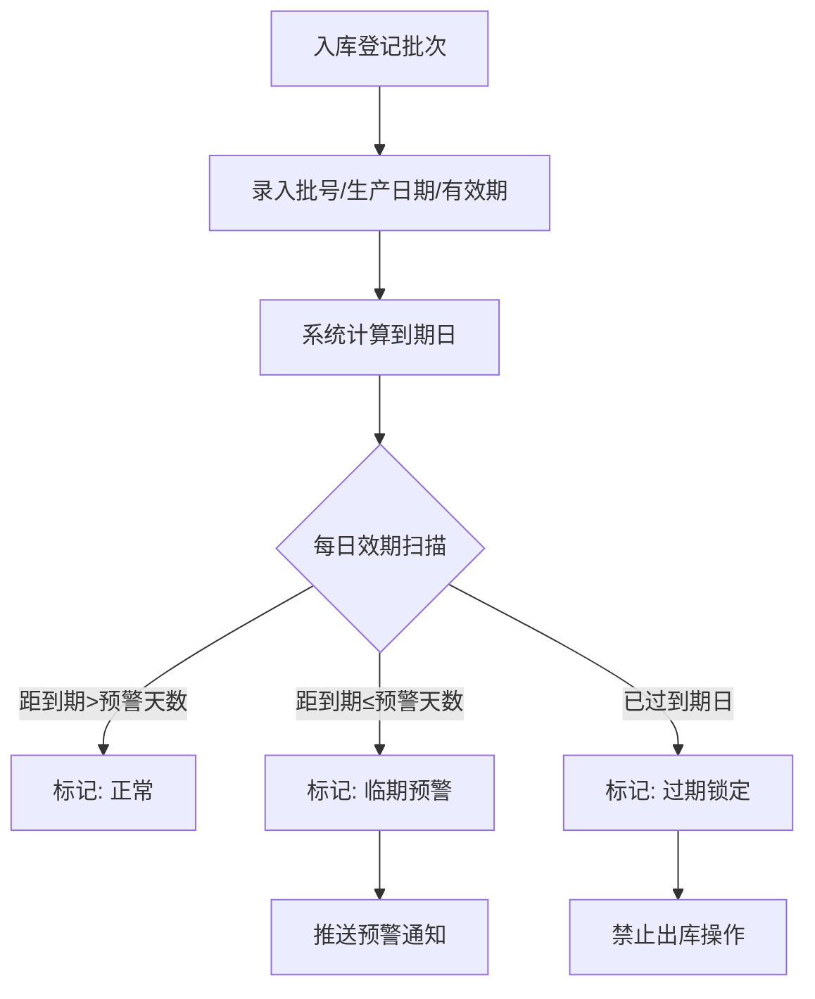
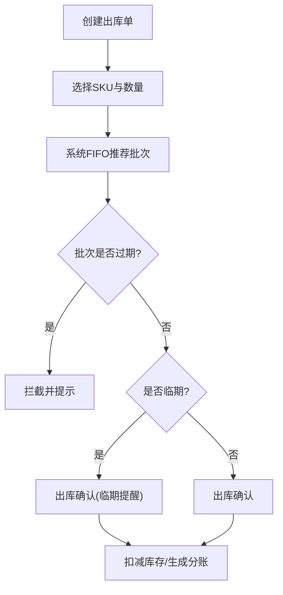
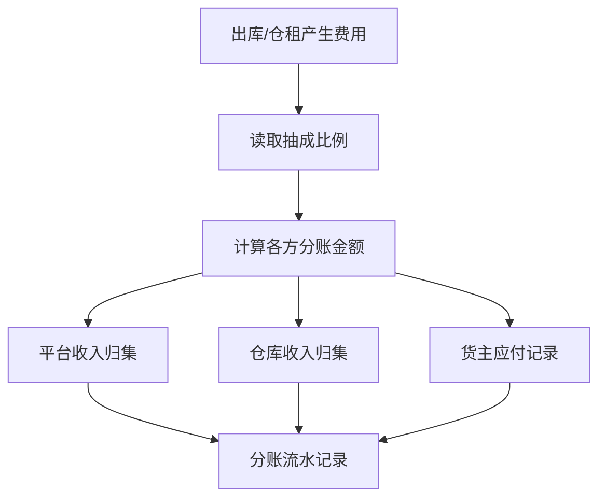
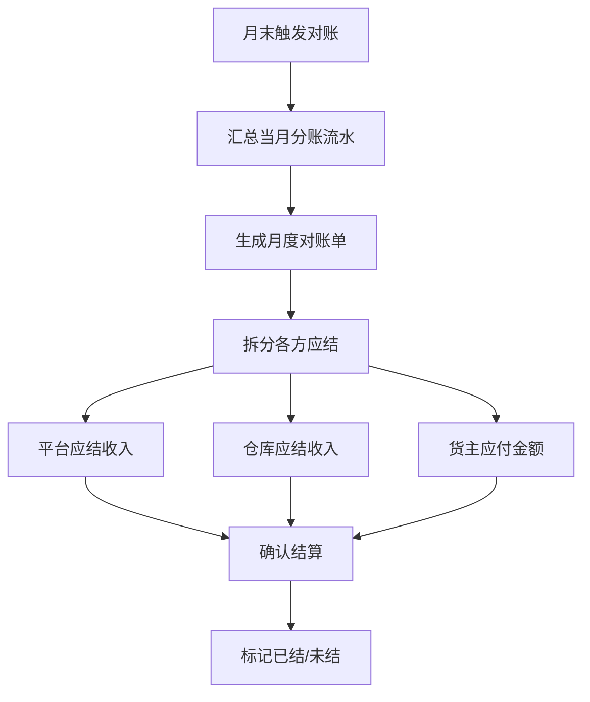

## 1. 产品概述

云仓库位管理移动App，面向仓储运营方与平台方，解决多货主、多品规的效期管控与仓储费分账难题。
- 核心价值：通过批次效期驱动的先进先出出库策略，降低临期/过期风险；按约定抽成比例自动拆账，实现多方可信分润与月底对账结算。
- 目标用户：仓储运营管理员、平台运营人员、货主（查看结算）

## 2. 核心功能

### 2.1 用户角色

| 角色 | 注册方式 | 核心权限 |
|------|----------|----------|
| 仓库管理员 | 平台分配 | 批次登记、出库操作、库位管理、预警处理 |
| 平台运营 | 平台分配 | 抽成比例配置、对账核出、结算审批、数据总览 |
| 货主 | 邀请注册 | 查看自持货品批次、出库记录、结算账单 |

### 2.2 功能模块

1. **首页仪表盘**: 关键指标概览、临期预警入口、快捷操作、待办事项
2. **批次效期页**: 批号效期登记表、效期日历、批次状态标签（正常/临期/过期锁定）
3. **效期出库页**: 出库单创建、FIFO推荐、过期拦截提示、出库确认
4. **抽成分账页**: 抽成比例配置、多方收入归集、仓租按日计费明细
5. **对账结算页**: 月度对账单生成、各方应结明细、结算确认

### 2.3 页面详情

| 页面名称 | 模块名称 | 功能描述 |
|----------|----------|----------|
| 首页仪表盘 | 关键指标卡片 | 在库批次数、临期批次数、过期锁定数、本月仓储费、待出库单 |
| 首页仪表盘 | 临期预警列表 | 按紧急程度排列的临期批次，支持一键跳转处理 |
| 首页仪表盘 | 快捷操作 | 新建批次登记、创建出库单、查看账单 |
| 批次效期页 | 批号效期登记表 | 录入批号、SKU、库位、生产日期、有效期、入库数量 |
| 批次效期页 | 效期日历 | 可视化展示各批次到期分布 |
| 批次效期页 | 批次状态标签 | 正常(绿)/临期(橙)/过期锁定(红)三种状态标识 |
| 批次效期页 | 临期预警配置 | 设置预警天数阈值（如30天/60天/90天） |
| 批次效期页 | 过期批次锁定 | 自动锁定过期批次，禁止出库操作 |
| 效期出库页 | 出库单创建 | 选择SKU与数量，系统自动推荐FIFO批次 |
| 效期出库页 | FIFO推荐 | 按效期最近优先排序，推荐出库批次组合 |
| 效期出库页 | 过期拦截 | 出库时检测批次效期，过期批次自动拦截并提示 |
| 效期出库页 | 出库确认 | 确认出库批次与数量，扣减库存 |
| 抽成分账页 | 抽成比例配置 | 按平台+货主约定设置各方抽成比例 |
| 抽成分账页 | 多方收入归集 | 实时归集各方收入，展示分账明细 |
| 抽成分账页 | 仓租按日计费 | 按库位占用×日费率自动计算每日仓租 |
| 抽成分账页 | 分账流水 | 每笔仓储费的分账记录流水 |
| 对账结算页 | 月度对账单 | 自动生成月度对账汇总，含各货主明细 |
| 对账结算页 | 各方应结明细 | 平台应结、仓库应结、货主应付明细拆分 |
| 对账结算页 | 结算确认 | 确认无误后锁定账单，标记已结/未结状态 |

## 3. 核心流程

### 3.1 批次效期管理流程

1. 仓库管理员入库时登记批号、生产日期、有效期，系统自动计算到期日
2. 系统每日自动扫描批次效期，根据预警阈值标记临期状态
3. 到期日到达后，系统自动将批次状态切换为「过期锁定」，禁止出库
4. 临期批次触发预警通知，推送至管理员仪表盘

### 3.2 效期出库流程

1. 管理员创建出库单，选择SKU与出库数量
2. 系统按效期先进先出原则，自动推荐最优出库批次组合
3. 如包含过期批次，系统自动拦截并提示不可出库
4. 确认出库后，扣减对应批次库存，生成分账记录

### 3.3 抽成分账流程

1. 平台与货主约定抽成比例，录入系统
2. 每笔出库产生的仓储费，按比例实时拆分至各方
3. 仓租按日计费：库位占用面积 × 日费率 × 占用天数
4. 所有分账流水实时归集，可追溯查询

### 3.4 对账结算流程

1. 月末系统自动汇总当月所有分账流水
2. 生成月度对账单，含各货主仓储费明细
3. 拆分各方应结金额：平台收入、仓库收入、货主应付
4. 管理员确认对账单，标记结算状态

## 4. 用户界面设计

### 4.1 设计风格

- **主色调**: 深色背景(#0f1419)搭配科技蓝(#3b82f6)主强调色，琥珀橙(#f59e0b)预警色，翡翠绿(#10b981)健康色，玫红(#ef4444)锁定/危险色
- **按钮风格**: 圆角胶囊按钮，主操作填充色，次操作描边色
- **字体**: 标题使用DM Sans（粗体），正文使用Noto Sans SC（常规体），数据展示使用JetBrains Mono
- **布局风格**: 移动端优先，底部Tab导航，卡片式信息布局，数据密度高但层次分明
- **图标风格**: Lucide线性图标，统一2px描边，配合色彩语义

### 4.2 页面设计概览

| 页面名称 | 模块名称 | UI元素 |
|----------|----------|--------|
| 首页仪表盘 | 关键指标卡片 | 深色卡片，数字用JetBrains Mono大号显示，趋势箭头动效 |
| 首页仪表盘 | 临期预警列表 | 横向滑动预警卡片，左侧色条标识紧急度，脉冲动画提示 |
| 首页仪表盘 | 快捷操作 | 底部悬浮圆角按钮组，图标+文字，点击缩放反馈 |
| 批次效期页 | 批号效期登记表 | 全屏表单，分段式录入，日期选择器，底部确认栏 |
| 批次效期页 | 批次列表 | 虚拟滚动列表，左侧状态色条，右侧效期倒计时 |
| 批次效期页 | 效期日历 | 热力图日历，颜色深浅表示到期密度 |
| 效期出库页 | FIFO推荐 | 卡片式批次推荐，从上到下优先级递减，推荐批次高亮 |
| 效期出库页 | 过期拦截 | 全屏红色遮罩提示，禁止按钮状态，锁定图标动画 |
| 抽成分账页 | 抽成比例配置 | 环形图展示各方占比，滑块调节比例 |
| 抽成分账页 | 仓租计费明细 | 时间轴+金额柱状图，每日仓租可视化 |
| 对账结算页 | 月度对账单 | 表格式对账明细，底部汇总栏，确认按钮 |

### 4.3 响应式设计

- 移动端优先（375px-428px），适配平板端（768px+）
- 触摸优化：按钮最小点击区域44px，滑动手势支持
- 底部Tab导航：首页、批次、出库、分账、对账

### 4.4 无3D场景
