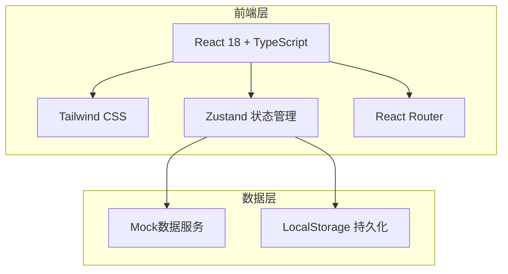

## 1. 架构设计



## 2. 技术说明

- 前端：React@18 + TypeScript + TailwindCSS@3 + Vite
- 初始化工具：vite-init
- 后端：无（纯前端Mock数据）
- 数据库：LocalStorage持久化 + 内存状态管理
- 状态管理：Zustand
- 路由：React Router DOM v6
- 图标：lucide-react
- 图表：recharts

## 3. 路由定义

| 路由 | 用途 |
|------|------|
| / | 首页仪表盘 - 关键指标、预警、快捷操作 |
| /batch | 批次效期 - 批号登记、效期管理、预警配置 |
| /batch/register | 批次登记 - 新增批号效期录入 |
| /batch/:id | 批次详情 - 单批次完整信息 |
| /outbound | 效期出库 - 出库单列表与创建 |
| /outbound/create | 创建出库 - FIFO推荐与出库确认 |
| /outbound/:id | 出库单详情 |
| /commission | 抽成分账 - 抽成配置、收入归集、仓租计费 |
| /settlement | 对账结算 - 月度对账单、各方应结明细 |

## 4. API定义（Mock数据接口）

```typescript
interface Batch {
  id: string
  batchNo: string
  sku: string
  skuName: string
  location: string
  productionDate: string
  expiryDate: string
  shelfLifeDays: number
  quantity: number
  remainingQuantity: number
  status: 'normal' | 'nearExpiry' | 'expired'
  ownerId: string
  ownerName: string
  createdAt: string
}

interface OutboundOrder {
  id: string
  orderNo: string
  sku: string
  skuName: string
  quantity: number
  batches: OutboundBatchItem[]
  status: 'pending' | 'confirmed' | 'completed'
  createdAt: string
  confirmedAt?: string
}

interface OutboundBatchItem {
  batchId: string
  batchNo: string
  quantity: number
  expiryDate: string
  isFifoRecommended: boolean
}

interface CommissionRule {
  id: string
  ownerId: string
  ownerName: string
  platformRate: number
  warehouseRate: number
  ownerRate: number
  effectiveFrom: string
}

interface CommissionRecord {
  id: string
  outboundOrderId: string
  totalFee: number
  platformShare: number
  warehouseShare: number
  ownerShare: number
  createdAt: string
}

interface DailyRent {
  id: string
  ownerId: string
  ownerName: string
  location: string
  area: number
  dailyRate: number
  date: string
  amount: number
}

interface SettlementBill {
  id: string
  period: string
  ownerId: string
  ownerName: string
  totalStorageFee: number
  platformIncome: number
  warehouseIncome: number
  ownerPayable: number
  status: 'pending' | 'confirmed' | 'settled'
  createdAt: string
  confirmedAt?: string
  details: SettlementDetail[]
}

interface SettlementDetail {
  type: 'outbound_fee' | 'daily_rent'
  referenceId: string
  description: string
  amount: number
  platformShare: number
  warehouseShare: number
  ownerShare: number
  date: string
}

interface ExpiryAlertConfig {
  warningLevel1Days: number
  warningLevel2Days: number
  warningLevel3Days: number
}
```

## 5. 服务器架构图

无后端服务，纯前端架构。

## 6. 数据模型

### 6.1 数据模型定义

```mermaid
erDiagram
    BATCH {
        string id PK
        string batchNo
        string sku
        string skuName
        string location
        string productionDate
        string expiryDate
        number shelfLifeDays
        number quantity
        number remainingQuantity
        string status
        string ownerId FK
        string createdAt
    }
    OUTBOUND_ORDER {
        string id PK
        string orderNo
        string sku
        string skuName
        number quantity
        string status
        string createdAt
    }
    OUTBOUND_BATCH_ITEM {
        string id PK
        string orderId FK
        string batchId FK
        string batchNo
        number quantity
        string expiryDate
        boolean isFifoRecommended
    }
    COMMISSION_RULE {
        string id PK
        string ownerId FK
        number platformRate
        number warehouseRate
        number ownerRate
        string effectiveFrom
    }
    COMMISSION_RECORD {
        string id PK
        string orderId FK
        number totalFee
        number platformShare
        number warehouseShare
        number ownerShare
        string createdAt
    }
    DAILY_RENT {
        string id PK
        string ownerId FK
        string location
        number area
        number dailyRate
        string date
        number amount
    }
    SETTLEMENT_BILL {
        string id PK
        string period
        string ownerId FK
        number totalStorageFee
        number platformIncome
        number warehouseIncome
        number ownerPayable
        string status
        string createdAt
    }
    BATCH ||--o{ OUTBOUND_BATCH_ITEM : "出库关联"
    OUTBOUND_ORDER ||--o{ OUTBOUND_BATCH_ITEM : "包含"
    OUTBOUND_ORDER ||--o{ COMMISSION_RECORD : "产生"
